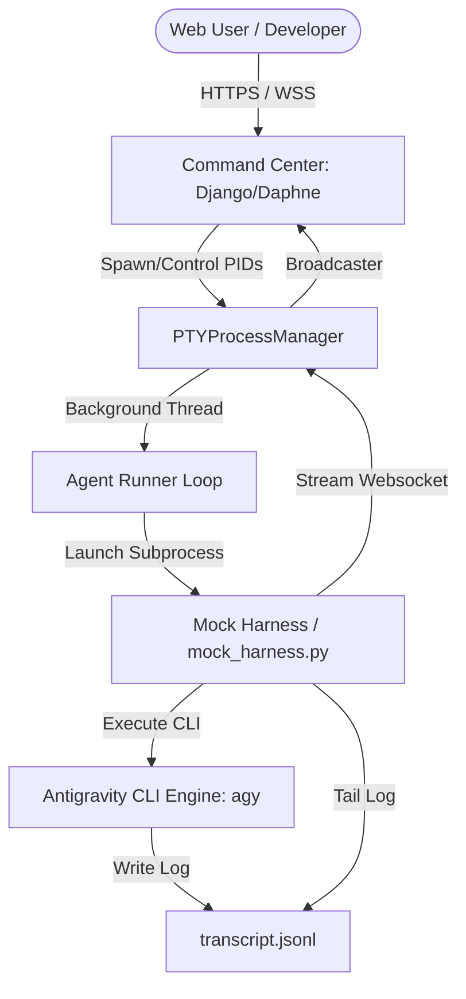
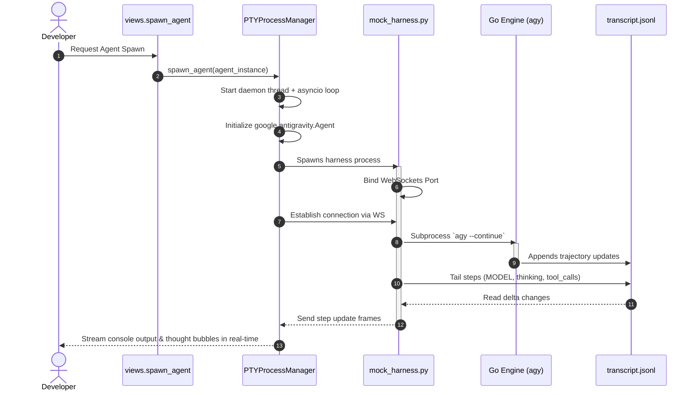
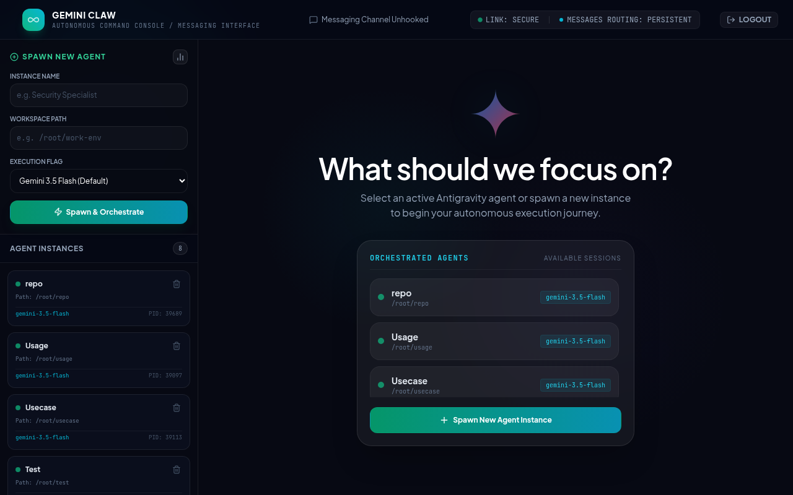
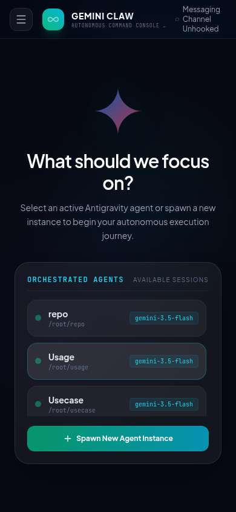

# 🚀 Antigravity Command Center

Welcome to the **Antigravity Command Center** repository. This project is a state-of-the-art, real-time dashboard and process orchestrator designed to spawn, control, and monitor autonomous AI agents powered by the **Antigravity SDK** and the **Antigravity CLI (`agy`)**. 

It delivers a premium, single-page, real-time experience featuring a collapsible terminal simulator, detailed thought tracking, dynamic file/image browsers, and comprehensive agent process management.

---

## 🏗️ System Architecture & Stack

The Command Center is engineered with a modern, asynchronous python stack to support highly responsive, bidirectional communication.



### Technology Stack
* **Web Framework**: Django 6.0.5 — Serves administrative tooling, templates, and API endpoints.
* **ASGI Server**: Daphne — Asynchronous gateway interface executing WebSocket streams and HTTP.
* **Real-time Engine**: Django Channels — Directs asynchronous group broadcasts using in-memory channel layers.
* **Process Manager**: Custom Thread Manager — Controls agent instances inside daemon threads via `asyncio` loops.
* **Intermediate Harness**: `mock_harness.py` — Bridges the SDK agent protocol and compiled Antigravity CLI `agy` subprocesses.
* **Frontend**: Vanilla HTML5 / Custom CSS — Modern premium dashboard with glassmorphism, responsive grids, and animations.
* **Database**: SQLite3 (`db.sqlite3`) — Persistent storage of agent instance configurations and process statuses.

---

## 📂 Key Codebase Components

* **[agent_command_center/](file:///root/repo/agent_command_center)**: The core Django project folder.
  * **[manage.py](file:///root/repo/agent_command_center/manage.py)**: Command-line utility for administrative tasks.
  * **[agent_command_center/settings.py](file:///root/repo/agent_command_center/agent_command_center/settings.py)**: Configures ASGI settings (`daphne`, `channels`), registers the `dashboard` application, and establishes `InMemoryChannelLayer`.
  * **[agent_command_center/asgi.py](file:///root/repo/agent_command_center/agent_command_center/asgi.py)**: Points to `ProtocolTypeRouter`, funneling HTTP traffic to views and `websocket` traffic through `AuthMiddlewareStack` to dashboard routers.
  * **[agent_command_center/urls.py](file:///root/repo/agent_command_center/agent_command_center/urls.py)**: Maps URLs, login/logout screens, and API routes.
  * **[dashboard/models.py](file:///root/repo/agent_command_center/dashboard/models.py)**: Defines `AgentInstance` tracking.
  * **[dashboard/consumers.py](file:///root/repo/agent_command_center/dashboard/consumers.py)**: Contains the core process logic:
    * `PTYProcessManager`: Launches daemon threads running the SDK agent runner, reads `conversation.receive_steps()`, and streams output back to Channels group listeners.
    * `AgentConsoleConsumer`: Manages client websocket tunnels, inputs sent into the agent's action loop, records prompt histories, and handles session history playbacks.
    * `AgentThoughtsConsumer`: Relays raw streaming `thinking_delta` packets straight to separate UI drawers.
    * `AgentGlobalConsumer`: Broadcasts global lists updates.
  * **[dashboard/views.py](file:///root/repo/agent_command_center/dashboard/views.py)**: Serves the dashboard page, facilitates file downloads (supporting only specific image extensions to prevent directory traversals), handles dynamic multi-modal photo uploads, and spawns/kills instances via `PTYProcessManager`.
  * **[dashboard/templates/dashboard/index.html](file:///root/repo/agent_command_center/dashboard/templates/dashboard/index.html)**: The master user interface. It implements advanced ANSI parsing to render rich, colorized TUI panels in pure HTML, features markdown converters for message bubbles, displays reactive floating tool pills, and offers workspace exploration side-panels.
* **[mock_harness.py](file:///root/repo/mock_harness.py)**: Bridges the SDK agent protocol and the `agy` Go engine.
* **[mock_agy.sh](file:///root/repo/mock_agy.sh)**: Fully emulated interactive mock version of the `agy` CLI engine used for fallback and testing on clean systems.
* **[skills/chrome-automation](file:///root/repo/skills/chrome-automation)**: Background Google Chrome automation skill providing remote headless browsing and scraping capabilities.

---

## ⚡ Real-Time Lifecycle of an Agent Run

When a developer clicks **"Spawn Agent"** on the dashboard, the following sequence is triggered:



### Process Control Signal Mapping
The process manager controls active subprocesses directly using OS signals:
* **Pause Action**: Executes `os.kill(pid, signal.SIGSTOP)`. The database updates to `paused`. The system freezes execution without losing thread stack data.
* **Resume Action**: Executes `os.kill(pid, signal.SIGCONT)`. The database updates to `running`.
* **Force-Kill Action**: Sets `stop_event` loop flag, invokes `os.kill(pid, signal.SIGKILL)`, and terminates session loops.

---

## 🎨 User Interface & Screenshots

The dashboard features a highly refined, glassmorphic dark design optimized for intensive engineering and agentic workflows.

### 🖥️ Desktop Interface
The desktop console is split into a collapsible responsive sidebar, live colored PTY console logs, real-time structured thought streams, and a dynamic file and visual explorer.


### 📱 Mobile Interface
The interface has been thoroughly optimized into a touch-friendly, edge-to-edge mobile app experience, allowing you to monitor and control autonomous runs on the go.


---

## ⚔️ Geminiclaw vs. Openclaw: Agentic UX Comparison

When executing complex, autonomous agentic operations, the quality of the developer-operator feedback loop is critical. Below is a structural comparison between **Geminiclaw** and **Openclaw**, detailing how Geminiclaw delivers a superior developer experience (UX) for managing AI agents:

| UX Capability | 🛸 Geminiclaw (This Project) | 🐚 Openclaw (Alternative) | Why it Matters for Agentic Tasks |
| :--- | :--- | :--- | :--- |
| **Real-time Thought Streaming** | **Word-by-word streaming** of reasoning deltas via WebSockets directly into active UI panels. | Wait-for-completion or chunky HTTP polling intervals. | **No more "black box" syndrome**. Operators see *exactly* what the model is thinking *as it thinks*, enabling instant detection of hallucination or logic loops. |
| **Active Process Suspension** | Native **Pause (`SIGSTOP`)** and **Resume (`SIGCONT`)** controls mapped directly to buttons. | Only supports binary **Force-Kill** or termination. | If an agent is running an expensive or risky command, you can freeze it mid-run, inspect files, and resume execution without losing session history or stack states. |
| **Thinking Trees & Tool Badges** | Parses markdown and tags into **collapsible thinking trees** and generates reactive, floating tool pills (e.g. `● Edit (file)`). | Prints unformatted raw text blocks and verbose command lists. | Minimizes cognitive fatigue. Verbose reasoning remains collapsed until needed, and tool executions are instantly scannable. |
| **Workspace Navigation** | Integrated **recursive file and image explorer** with clickable markdown files and media preview panels. | Static terminal readouts or external IDE integration required. | Gives the operator instant visual confirmation of agent output (e.g., viewing generated screenshots, logs, and plans) in the same window. |
| **Mobile Responsiveness** | Built as a **Progressive Web App (PWA)** with a fluid flex layout and touch-friendly controls. | Single conversation in a Messaging App  | Allows engineers to safely monitor, pause, or interact with long-running, critical server tasks from their smartphones |

---

## ⚙️ Server Installation & Configuration

A comprehensive, production-grade bash installation script `install.sh` is provided in this repository to automate complete server setup.

### What the installer does:
1. Updates package indexes and installs dependencies (`curl`, `git`, `python3-venv`, `gpg`, etc.).
2. Installs **Google Chrome Stable** (`google-chrome-stable` package) from the official Google deb repository.
3. Sets up the main virtual environment in `/root/venv` and installs Django, Channels, and Google Antigravity SDK packages.
4. Installs the Go engine (`agy`) executable to `/root/.local/bin/agy` (with an interactive shell mock fallback if the binary is not present).
5. Configures a separate Python virtual environment for Chrome remote automation (`/root/chrome/venv`) and installs/downloads Playwright Chromium along with its OS dependencies.
6. Installs Custom Agent Skills (`chrome-automation`) under standard global config folders.
7. Deploys the codebase, runs migrations, and seeds standard administrative credentials.
8. Writes, registers, and starts the systemd service `/etc/systemd/system/django-daphne.service` running the web dashboard seamlessly with an automatic restart loop.

### How to Run the Installer:
Clone the repository to your server and run `install.sh` as `root` (or with `sudo`):

```bash
sudo ./install.sh
```

---

## 🔑 Seeded Administrator Account

To log in or access admin views (`/admin/`), use these standard credentials seeded automatically by the installer:
* **Username**: `admin`
* **Password**: `antigravity-secure-2026`
* **Email**: `admin@localhost`

## 📊 Managing the Daphne Service

Monitor and control the background Daphne application using standard systemd tools:

* **Check Service Status**: `systemctl status django-daphne.service`
* **View Logs in Real-time**: `journalctl -u django-daphne.service -f`
* **Restart the Server**: `systemctl restart django-daphne.service`
* **Stop the Server**: `systemctl stop django-daphne.service`
